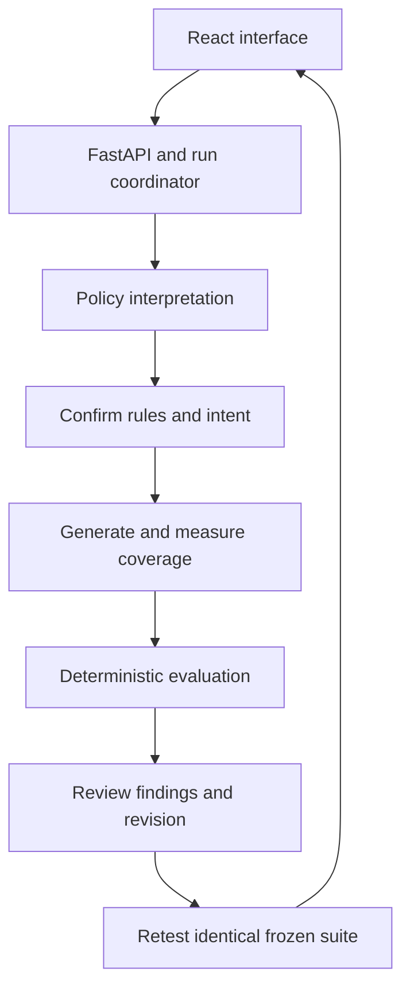

# PolicyFuzz

**Building v2?** Start with the [two-person development guide](docs/v2/README.md).
The v2 foundation defines exactly four agents: Orchestrator Agent, Metric Agent,
Sandbox Agent and Judge Agent. It includes a shared Sandbox contract and labelled
offline fixtures. The live adapter and full v2 application are the next work packets.
Use the v2 ownership guide for new work; the quickstart and five-person allocation
below describe the existing v1 application.

PolicyFuzz turns a supported subset of a travel-and-expense policy into cited executable rules, stress-tests them, and checks whether an approved structured revision fixes failures on the same frozen suite.

Use synthetic or explicitly non-confidential policy text only. This is a hackathon prototype, not legal advice or a compliance certification. Suggested prose is unverified: the deterministic engine tests the structured revision.

## Quickstart: recorded demonstration

Preparing for a first demo? The [rehearsal guide](docs/demo-day-guide.md) includes Windows setup, safe key entry, a walkthrough, judging questions and a labelled fallback.

Requirements: Python 3.12+, Node 20+ and Git. Use two terminals from a clone of this repository. The default backend mode is `cached`; it requires no provider key. The frontend talks to the real local API and displays the cached label.

After the one-time dependency installation below, you can launch both services
from the repository root with **`npm run dev`**. Press Ctrl+C to stop both.
Use `npm run dev -- --mock` for the labelled interactive screen rehearsal.
`npm run dev -- --agents` also starts the optional exploratory engine, after
installing its dependencies in `engine/.venv`. The launcher does not save keys.
The core backend reads its process environment; the optional engine also reads
`engine/.env` and uses separate settings documented in [engine/README.md](engine/README.md).
MiroFish itself must be running separately for external agent conversations.

See the [semifinal refinement record](docs/semifinal-refinement.md) for the latest
reliability changes, verification results and remaining rehearsal checks.

Terminal 1, macOS/Linux:

```bash
python3 -m venv backend/.venv
backend/.venv/bin/python -m pip install -e './backend[dev]'
cd backend
APP_MODE=cached .venv/bin/python -m uvicorn app.main:app --reload --port 8000
```

Terminal 2, macOS/Linux:

```bash
cd frontend
npm ci
VITE_DATA_MODE=http npm run dev
```

Open the URL printed by Vite, normally `http://127.0.0.1:5173`. Choose the bundled `development-policy` sample. The cached API replays a completed recorded demonstration; use the explicitly labelled mock mode to rehearse each interactive screen offline.

Terminal 1, PowerShell:

```powershell
py -3.12 -m venv backend/.venv
backend\.venv\Scripts\python.exe -m pip install -e './backend[dev]'
cd backend
$env:APP_MODE='cached'
.venv\Scripts\python.exe -m uvicorn app.main:app --reload --port 8000
```

Terminal 2, PowerShell:

```powershell
cd frontend
npm ci
$env:VITE_DATA_MODE='http'
npm run dev
```

To use the authored interface fixtures instead, set `VITE_DATA_MODE=mock` before starting Vite. Mock screen fixtures are separate from the recorded API cache.

After installing dependencies, open a new terminal at the repository root (the folder containing `backend` and `frontend`) and check local setup without making provider calls:

```powershell
backend\.venv\Scripts\python.exe scripts/check_setup.py --mode cached
```

Use `--mode live` after setting the backend environment, or `--mode mock` for frontend-only rehearsal. On macOS/Linux use `backend/.venv/bin/python`. This checks local configuration, not API authentication, account quota, model compatibility or browser acceptance.

Cached mode also validates the recorded run and its evidence links. Live mode constructs and closes the OpenAI client with a dummy key to catch local transport/dependency failures; it sends no API request. These checks leave the files and process environment unchanged.

## Live hosted-model setup

Set `APP_MODE=live`, `LLM_PROVIDER=openai`, `LLM_MODEL` to a model available to your project, and `OPENAI_API_KEY` in the backend process environment, then restart it. Keep the browser in HTTP mode. Pasted text is sent to the configured provider after the required acknowledgement. Never commit a key or a real policy. No credentials are needed for tests, replay or CI.

The backend does **not** automatically read `.env` files. Set variables in the terminal that starts Uvicorn; the [Windows guide](docs/demo-day-guide.md#enable-live-ai-when-the-backend-operator-is-ready) provides a hidden key prompt. A live badge or `provider_configured=true` is a configuration signal, not a successful provider request.

| Variable | Purpose |
| --- | --- |
| `APP_MODE` | `cached` or `live` backend execution |
| `OPENAI_API_KEY` | Server-side provider credential |
| `LLM_PROVIDER` | Supported hosted provider |
| `LLM_MODEL` | Model identifier configured for the provider project |
| `LLM_TIMEOUT_SECONDS` | Per-attempt transport timeout |
| `RUN_TTL_SECONDS` | Run retention, at most 3,600 seconds |
| `MAX_POLICY_CHARS` | Pasted-text limit, at most 50,000 characters |
| `POLICYFUZZ_ALLOWED_ORIGIN` | Single permitted local browser origin |
| `VITE_DATA_MODE` | `http` for API; `mock` for authored UI fixtures |
| `VITE_API_BASE_URL` | Optional API origin; empty uses the Vite proxy |

## How a run works



The coordinator plans the run, invokes specialist stages, observes measured coverage, requests at most one targeted batch, freezes the suite, and retests one confirmed revision. Model output may propose rules, intent and exploratory facts. Python owns citations, validation, exact boundaries, verdicts, root-cause grouping, hashes, metrics and patch acceptance. Only confirmed intent or independent mechanical/gold assertions can produce scored outcomes; model-generated exploratory cases cannot grade themselves.

Supported inputs are English text and the bundled synthetic sample. Rules use AND predicates over role, category, SGD integer-cent amount, travel type, booking lead time, receipt, approval roles and prior daily category spending. The supported operators are `eq`, `neq`, `in`, `not_in`, `lt`, `lte`, `gt`, `gte`, and `contains`. Effects cover eligibility, receipt, approval, claim cap and daily category cap. Limits are 12 rules, 10 initial cases plus 5 targeted cases, and one revision with at most 3 operations. PDF/OCR, authentication, persistence, external integrations and prose recompilation are outside the core build.

## Team ownership and files

| Person | Ownership | Handoff |
| --- | --- | --- |
| 1 | Shared contracts, infrastructure, coordinator, API, CI and packaging | [Integration](team/person-1-integration/HANDOFF.md) |
| 2 | Policy ingestion, citations, compiler, invariant suggestions and revisions | [Policy](team/person-2-policy/HANDOFF.md) |
| 3 | Mechanical/exploratory scenarios, validation, coverage and freezing | [Fuzzing](team/person-3-fuzzing/HANDOFF.md) |
| 4 | Deterministic evaluation, findings, patches, regression and metrics | [Evaluation](team/person-4-evaluation/HANDOFF.md) |
| 5 | React UI, submission source, video and blind-corpus custody | [Product](team/person-5-product/HANDOFF.md) |

`backend/app/domain` defines frozen shared contracts. `core` contains infrastructure; `workflow` coordinates stages; `features/{policy,fuzzing,evaluation}` contains specialist code. `frontend/src` consumes only the public API. `contracts` contains generated schemas and integration references, `samples` contains synthetic demonstrations, `scripts` contains reproducibility and packaging tools, and `submission` contains pitch/video sources and evidence.

Read the root and scoped `AGENTS.md` before editing. Use short-lived `pN/feat-description` branches and conventional commits. Person 1 integrates shared contracts first, then evaluator, policy/fuzzing, workflow/API, UI acceptance and submission evidence. Keep one writer per path; do not change specialist interfaces on independent branches.

## Public API

The frozen [OpenAPI registry](contracts/openapi.json) is authoritative. [Task 4 integration](contracts/task4-integration.md) and [workflow integration](contracts/task19-workflow.md) describe the Python contracts and hash semantics.

```bash
curl http://127.0.0.1:8000/api/v1/health
curl -X POST http://127.0.0.1:8000/api/v1/runs -H 'Content-Type: application/json' -d '{"source_type":"bundled_sample","title":"Synthetic demo","sample_id":"development-policy"}'
curl http://127.0.0.1:8000/api/v1/runs/RUN_ID
curl -X DELETE http://127.0.0.1:8000/api/v1/runs/RUN_ID
```

Use the returned run ID. Confirmation actions are `confirm-contract`, `select-findings` and `confirm-revision`; submit the matching pending-confirmation data and frozen request body shown by OpenAPI. Re-fetch after a conflict. Do not manufacture confirmation anchors or infer success from a stage-entry event.

Accepted contract and finding decisions return the active `RunView` promptly while owned background jobs perform model work. Continue polling `GET /api/v1/runs/{run_id}` for the next confirmation or terminal result. A successful confirmation response records acceptance of the command; it does not mean the model stage has finished.

## Verification and benchmarks

From the repository root after setup:

```bash
backend/.venv/bin/python -m pytest backend/tests -q
backend/.venv/bin/python -m ruff check backend/app backend/tests
backend/.venv/bin/python -m ruff format --check backend/app backend/tests
backend/.venv/bin/python scripts/validate_contracts.py
backend/.venv/bin/python scripts/replay_check.py
backend/.venv/bin/python scripts/verify_benchmarks.py
backend/.venv/bin/python scripts/offline_smoke.py
npm --prefix frontend run check:generated
npm --prefix frontend run typecheck
npm --prefix frontend run test:run
npm --prefix frontend run build
```

On Windows replace the interpreter with `backend\.venv\Scripts\python.exe`. Tests use scripted provider responses and never make live model calls. The offline smoke runs the real compiler/planner/evaluator workflow around those responses. Replay checks identical frozen evidence three times.

The development policy deliberately seeds a receipt-boundary gap, a competing hotel-approval rule and a split-meal daily-intent breach. A corrected control and the same frozen suite test regression. These are synthetic technical checks. Blind benchmark results are headline-eligible only after independent human label review and the sealed first-run procedure. The active custody metadata records the current eligibility; do not turn pending reviews into measured performance claims.

The authored benchmark has 15 cases; the generated demonstration has ten. The strict scorer requires exact authored scenario and contract identities. It therefore cannot automatically turn a normal workflow's first-run result into discovery recall. A separate `assess-gold` command evaluates the captured baseline on revealed gold cases, preserves the original run, and labels its output **post-run gold-assisted assessment**. That result cannot satisfy the first-run discovery gate. See [task status](docs/implementation-status.md) for the remaining measurement and human-review requirements.

After authorized reveal and a preserved attempt, the separate assessment command is:

```bash
backend/.venv/bin/python -m app.features.evaluation.benchmark_cli assess-gold \
  --run-result team/person-1-integration/evidence/blind-first-run.json \
  --run-metadata team/person-1-integration/evidence/blind-first-run.json.metadata.json \
  --benchmark-dir samples/benchmarks/blind \
  --schema-seal submission/evidence/benchmark-v2/blind-schema-seal.json \
  --output team/person-4-evaluation/evidence/blind-gold-assessment
```

Use the active candidate's schema-seal path if a separately reviewed candidate supersedes version 2. The destination must be new. Preserve manual observations using the [review record format](docs/manual-review-format.md). No blind result or approval is bundled with this implementation.

## Submission

Pitch sources are in `submission/deck`; narration/shot-list sources are in `submission/video`. Draft filenames are deliberately labelled. Final deliverables are `PolicyFuzz-Pitch.pptx`, `PolicyFuzz-Pitch.pdf`, `PolicyFuzz-Demo.mp4` and captions `PolicyFuzz-Demo.srt`. [Submission checklist](submission/checklist.md) records actual remaining gates.

Final packaging requires verified evidence, final media, a clean checkout at annotated `demo-v1`, and all prescribed reviews:

```bash
backend/.venv/bin/python scripts/package_submission.py --check-only
backend/.venv/bin/python scripts/package_submission.py --tag demo-v1 --output dist/policyfuzz-submission.zip
```

The packager fails closed on missing deliverables, invalid evidence, secrets, symlinks or an incorrect tag. It never promotes a draft to a verified submission. Follow Gate B, the six-hour frozen-build interval and final media checks in the [implementation plan](docs/superpowers/plans/2026-09-04-policyfuzz-implementation.md).

## Troubleshooting and limitations

- If the frontend cannot connect, start the backend on port 8000 and use Vite's proxy or one configured local origin. Restart Vite after changing frontend environment variables.
- If live mode reports provider unavailable, check the server's configured model and key. Transport retries are bounded; malformed output gets at most one feature repair.
- A `409` means the action is stale or not valid at the current stage. Fetch the latest run; a `404` means it expired or was deleted.
- Runs and pasted text are held in memory for at most one hour. Delete removes application state and cancels its jobs; it cannot retract data already sent to the provider. Restarting the server loses in-memory runs.
- Coverage exhaustion, unsupported clauses and rejected output remain visible. An unverified or rejected revision is never shown as a successful policy fix.
- The repository includes an earlier optional engine-sidecar experiment; the MVP uses the frozen local specialist protocols. It is not required for this quickstart.

No open-source licence has been selected. Repository visibility alone does not grant a licence; the team must choose one before promising unrestricted reuse.
