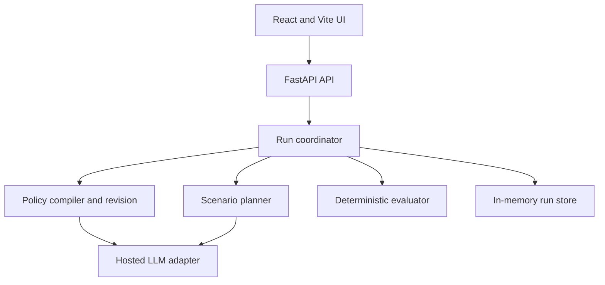

# PolicyFuzz MVP Design

**Date:** 4 September 2026

**Status:** Approved for implementation

**Repository target:** `Luigi-Simon/policyfuzz`

## 1. Executive summary

PolicyFuzz is a bounded quality-assurance system for employee travel-and-expense policies. A finance or people-operations owner selects the bundled sample or pastes a supported policy. PolicyFuzz converts supported clauses into cited executable rules, asks the user to confirm the interpretation and intended behavior, generates normal, boundary, and adversarial scenarios, and executes them with deterministic Python code. It groups reproducible gaps, conflicts, and intent breaches into findings, proposes one reviewable structured revision, and reruns the exact frozen suite after explicit session confirmation.

The product claim is deliberately narrow:

> PolicyFuzz converts a supported subset of a travel-and-expense policy into cited executable rules, stress-tests those rules, and provides reproducible evidence of whether a session-confirmed structured revision fixes confirmed failures in a frozen suite without breaking its protected cases.

PolicyFuzz does not claim that a policy is legally compliant, universally correct, or free of every real-world loophole.

## 2. Hackathon alignment and deliverables

The solution answers the challenge by helping a policy remain usable as circumstances, thresholds, exceptions, and employee behavior change. Its agentic loop is `plan -> act -> observe -> adapt -> retest`:

1. Compile cited rules from a policy.
2. Validate the compilation and repair malformed model output once.
3. Plan an initial scenario suite around rule structure and confirmed intent.
4. Execute a provisional scan through deterministic tools.
5. Observe measured rule and invariant coverage.
6. Request at most one targeted generation cycle, then rerun and freeze the complete suite.
7. Execute the frozen suite as the authoritative baseline.
8. Propose a revision for accepted findings.
9. Pause for explicit session confirmation.
10. Apply the confirmed structured revision and rerun the frozen suite.

The repository must support the official deliverables:

- Project files or workflow, below 5 GB, submitted once.
- Presentation deck of at most 10 slides.
- Digital solution video of at most 5 minutes. The team will submit this rather than a physical-simulation recording.

The submission must explain the problem and innovation, demonstrate agentic AI, show technical soundness and functionality, establish business impact, and demonstrate alignment with the problem statement.

## 3. Target user and problem

The beachhead user is a finance or people-operations owner responsible for publishing an employee travel-and-expense policy.

The product hypothesis is that policy owners still rely heavily on prose review and therefore struggle to inspect every exact threshold, overlapping exception, approval path, and combination of otherwise valid claims. PolicyFuzz must be compared against the team's documented manual-review baseline; the deck will not present this hypothesis as validated market research. The product differentiator being tested is a frozen, reproducible regression suite with deterministic execution traces rather than document summarization alone.

PolicyFuzz provides a policy QA workflow analogous to continuous integration for code. The initial product uses synthetic policies only.

## 4. MVP scope

### 4.1 Included

- One policy per run.
- The bundled synthetic policy or pasted English text following the supported T&E vocabulary.
- Maximum 50,000 pasted characters.
- Travel-and-expense rules in SGD.
- Integer minor units for every monetary value.
- At most 12 compiled rules and 15 accepted scenarios per run.
- Normal, boundary, adversarial, and one targeted follow-up generation cycle.
- Exact source citations for every baseline executable rule; patched rules use explicit session-revision provenance.
- Session confirmation of the compiled rules and three to five intent invariants.
- One revision proposal and one confirm-or-reject decision.
- Session-confirmed structured rule revision and frozen-suite comparison.
- One development benchmark, one separately authored blind benchmark, and one corrected control policy.
- A clearly labelled cached-demo mode using recorded model artifacts.

### 4.2 Excluded

- Arbitrary policy domains or legal-compliance certification.
- PDF ingestion, image-only PDFs, OCR, and table extraction.
- Authentication, user accounts, collaboration, or multi-tenancy.
- Databases, vector stores, RAG, document search, and policy history.
- Live currency conversion or external enterprise integrations.
- Nested Boolean expressions, arbitrary code, or model-generated executable code.
- Automatic publication of revised policies.
- Multiple repair iterations or an unbounded autonomous loop.

### 4.3 Stretch goals

- Text-based PDF ingestion with the same 20-page, 2 MB, and 50,000-character limits.
- Apply drafted wording to normalized policy text, recompile it, and verify semantic equivalence against the session-confirmed structured revision.
- One automated browser smoke test in addition to component and integration tests.

## 5. User journey

1. The user chooses the bundled sample or pastes policy text. Arbitrary pasted policies are clearly labelled experimental outside the supported synthetic T&E format.
2. The UI shows the cited compiled rules and unsupported clauses.
3. The user confirms the rule interpretation and edits or confirms three to five proposed intent invariants.
4. PolicyFuzz builds an initial suite of normal, boundary, adversarial, and mechanical tests.
5. It executes a provisional scan, measures uncovered rules and invariants, and may add one targeted batch. It then freezes the final suite and reruns it as the authoritative baseline.
6. A visible activity timeline shows high-level agent actions and tool results without exposing private chain-of-thought.
7. The results screen shows per-dimension outcomes, traces, citations, coverage, and grouped findings.
8. The user accepts or rejects the mechanically reproduced and session-confirmed findings that the revision agent may address.
9. The revision agent proposes a minimal structured rule diff and unverified draft wording.
10. The user confirms or rejects the proposal. Rejection ends the run without modifying the policy.
11. On confirmation, PolicyFuzz applies the structured diff to a copy of the confirmed rule set and reruns the identical frozen suite.
12. The comparison screen reports fixed, remaining, unchanged, regressed, inconclusive, and errored cases. Draft wording remains explicitly unverified unless the stretch recompilation path succeeds.

## 6. Architecture

PolicyFuzz is a contract-first modular monolith.



The frontend polls a display-safe `RunView` every one to two seconds. WebSockets and server-sent events are excluded. The backend uses an explicit finite-state coordinator and in-memory storage because the hackathon MVP supports one demo user and one process. A checked-in cached run provides a labelled fallback for the video or live demonstration.

### 6.1 Backend modules

| Module | Responsibility | Dependencies |
|---|---|---|
| `api` | Validate HTTP requests and expose `RunView` | Domain models and coordinator only |
| `core` | Configuration, canonical hashing, errors, logging, LLM protocol and provider adapter | No feature internals |
| `domain` | Authoritative Pydantic models and stage protocols | Pydantic only |
| `workflow` | Run state, stage transitions, retries, orchestration and store | Public stage protocols |
| `features.policy` | Text ingestion, cited extraction, invariant suggestions, structured revision and draft wording | Domain models and LLM protocol |
| `features.fuzzing` | Mechanical boundary tests, LLM exploratory tests, validation, deduplication and coverage planning | Domain models and LLM protocol |
| `features.evaluation` | Predicate evaluation, effect resolution, traces, findings, deterministic patch validation/application, metrics and regression comparison | Domain models only; no LLM |

Feature modules do not call API routes, manipulate the run store, or import another feature's internals. The coordinator wires them through typed protocols.

### 6.2 Technology choices

- Frontend: React, Vite, TypeScript, native `fetch`, and Vitest.
- Backend: Python 3.12, FastAPI, Pydantic 2, `pytest`, and the official hosted-model SDK behind a provider-neutral protocol.
- Orchestration: ordinary typed Python functions and an explicit coordinator; no LangGraph or multi-agent framework.
- Storage: in-memory `RunStore` plus checked-in JSON fixtures and a cached demonstration artifact.
- Configuration: `LLM_PROVIDER`, `LLM_MODEL`, and provider credentials are server-side environment variables. The selected model and prompt versions are recorded in each run manifest.

## 7. Agentic behavior and trust boundaries

The system uses three reasoning roles rather than an ornamental swarm:

- **Policy agent:** extracts cited rules, suggests intent invariants, explains unsupported clauses, and drafts revised wording.
- **Fuzz planner:** selects normal, threshold, cross-rule, and adversarial scenario goals. Python adds exact `threshold - 1`, `threshold`, and `threshold + 1` cases.
- **Revision agent:** receives only accepted findings and visible witness traces, then proposes one minimal revision.

The coordinator maintains explicit run state, calls tools, observes validation and coverage, and permits one bounded adaptation cycle. The planner receives uncovered rule IDs, uncovered invariant IDs, uncovered threshold branches, remaining scenario capacity, and already-used fact combinations. Its allowed actions are `accept_initial_suite`, `request_targeted_rule_cases`, `request_targeted_invariant_cases`, or `stop_with_coverage_limit`. It may add at most five targeted scenarios without exceeding the total cap.

The final suite is frozen only after this adaptation cycle. The system then discards provisional verdicts and reruns the complete frozen suite as the authoritative baseline. If every supported rule and confirmed invariant cannot be exercised within 15 accepted scenarios, the run terminates as `coverage_limit_exceeded`; it does not proceed to revision. The demo reports adaptation lift as final covered targets minus initially covered targets, alongside the number of targeted scenarios added.

LLMs may interpret, generate, and explain. They may not assign authoritative outcomes, severity, metric values, or expected answers for their own exploratory scenarios. Python validates citations, generates numeric boundaries, executes rules, detects mechanical failures, freezes artifacts, and performs comparisons. The current user session confirms the baseline interpretation, policy intent, and any revision.

## 8. Domain contracts

Every contract carries `schema_version: "1.0"`. Stored artifacts use an envelope containing `artifact_type`, `schema_version`, `artifact_sha256`, `semantic_sha256`, `parent_hashes`, `run_manifest_id`, and `payload`.

Hashes use UTF-8 JSON after Unicode NFC normalization, key sorting, compact separators, and integer-only numeric serialization. `artifact_sha256` covers the complete payload except self-referential hash fields; `semantic_sha256` covers the domain fields used for equality and excludes timestamps, event logs, confidence, and presentation summaries. A `RunManifest` separately records the run ID, engine version, schema version, prompt hashes, provider, model identifier, generation configuration, random seed, start time, and whether the run is live or cached.

### 8.1 `PolicyDocument`

- `document_id`
- `title`
- `source_type`: `pasted_text | bundled_sample` (`pdf` is reserved for the stretch parser)
- `pages[]`: page number, extracted text, start offset, end offset
- `document_sha256`

### 8.2 `PolicyIR`

- `policy_id`
- `document_sha256`
- `review_status`: `provisional | session_confirmed`
- `base_currency`: always `SGD` in version 1
- `rules[]`
- `unsupported_clauses[]`

An unsupported clause stores its exact source span, reason code, affected effect dimensions, and an optional supported `when_hint`. The current session confirms those mappings with the baseline interpretation. If the hint matches a scenario—or applicability is unknown for a required affected dimension—the evaluator reports `INCONCLUSIVE` rather than converting the extraction limitation into a policy gap. The gap is called `structural_gap` only when no confirmed unsupported clause can affect that scenario and dimension.

Each `Rule` contains:

- Stable baseline ID derived from the semantic rule signature plus source-span hash, and a short description. A structured `replace_rule` operation preserves this ID and increments `revision`.
- `when[]` predicates with AND semantics.
- `effects[]` containing dimension and value.
- Dimension-specific `overrides[]` references; each reference names a lower-precedence rule that this rule supersedes when both apply.
- Discriminated provenance. A baseline compiled rule uses `text_citation` with exact section, page, character range, quote, and quote hash. A structured patched rule uses `session_revision` with proposal ID, operation index, confirmation timestamp, and the baseline citation IDs that motivated the change.
- Extraction confidence for display only.

Supported fact fields are:

- `employee_role`
- `expense_category`
- `amount_minor`
- `destination_type`
- `booking_days_before`
- `receipt_present`
- `approval_roles_present`
- `prior_same_day_category_spend_minor`

For daily-cap evaluation, Python derives `daily_category_total_minor` by adding the current claim amount to prior same-day category spending. No transaction database or arbitrary aggregation window is implemented.

Field domains and valid operators are fixed:

| Field | Type or domain | Valid operators |
|---|---|---|
| `employee_role` | `employee | manager | director | executive` | `eq`, `neq`, `in`, `not_in` |
| `expense_category` | `meal | hotel | transport | airfare | incidental` | `eq`, `neq`, `in`, `not_in` |
| `amount_minor` | integer from 0 to 10,000,000 | `eq`, `neq`, `lt`, `lte`, `gt`, `gte` |
| `destination_type` | `domestic | international` | `eq`, `neq`, `in`, `not_in` |
| `booking_days_before` | integer from 0 to 365 | `eq`, `neq`, `lt`, `lte`, `gt`, `gte` |
| `receipt_present` | Boolean | `eq`, `neq` |
| `approval_roles_present` | set of `manager | director | finance` | `contains` |
| `prior_same_day_category_spend_minor` | integer from 0 to 10,000,000 | `eq`, `neq`, `lt`, `lte`, `gt`, `gte` |

All predicates are type-checked before execution. For each effect dimension, applicable rules are collected, then the targeted lower-precedence effects named by applicable rules' `overrides[]` entries are removed. Zero remaining values is a gap, one unique value is resolved, and multiple unique values are a conflict. Dangling overrides and override cycles invalidate the entire rule set.

Supported predicates are `eq`, `neq`, `in`, `not_in`, `lt`, `lte`, `gt`, `gte`, and `contains`. Conditions are AND-only; the compiler expands OR prose into separate rules. Override references must exist and override cycles invalidate the rule set.

Supported effect dimensions are:

- `eligibility`: `allow | deny`
- `receipt_requirement`: `required | not_required`
- `approval_requirement`: `none | manager | director | finance`
- `claim_cap_minor`: non-negative integer
- `daily_category_cap_minor`: non-negative integer

### 8.3 `PolicyContract`

The contract separates intended behavior from published behavior. It records globally required effect dimensions and three to five session-confirmed invariants. Each invariant contains conditions, one machine-checkable assertion, severity, and `origin: session_confirmed`. Invariant conditions may also use the Python-derived `daily_category_total_minor`; executable policy rules may not.

An `Assertion` contains a stable ID, target kind (`effect_value | compliance_value`), effect dimension, operator (`eq | neq | lte | gte`), typed expected value, origin, and source invariant or gold-label reference. Type validation rejects incompatible operators and values.

Without an independent invariant, PolicyFuzz may prove a gap or conflict but may only label suspicious allowed behavior as a review candidate.

### 8.4 `ScenarioSuite`

The suite records its ID, content hash, seed, baseline document, policy-contract and rule-set hashes, engine version, and scenarios. Each scenario contains:

- Stable ID derived from facts, sorted assertions, targets, protection flag, and partition. Identical facts with compatible assertions in the same partition are merged before hashing; their provenance is retained as a sorted `origins[]` set.
- Category: `normal | boundary | adversarial`.
- `origins[]`: one or more of `gold | session | mechanical | llm_exploratory`.
- Complete facts for all eight supported fields.
- Target rule and invariant IDs.
- Zero or more assertions.
- `protected` regression flag.
- `visible | holdout` partition.

Scored assertions may originate only from a gold benchmark, a session-confirmed invariant, or a mechanical relation generated by Python. Schema validation rejects an LLM-authored oracle. Rejected and duplicate scenarios are retained in run statistics.

Within the 15-scenario limit, the planner must cause every compiled rule to fire in at least one valid scenario and every confirmed invariant's conditions to match at least one valid scenario. Predicate-branch coverage beyond that minimum is measured and reported, not guaranteed. Failure to meet the minimum after the single targeted cycle produces `COVERAGE_LIMIT_EXCEEDED` and blocks revision.

### 8.5 `EvaluationReport`

Every scenario has an independent result for each required effect dimension:

- `VALUE`: applicable rules resolve to one value.
- `GAP`: no applicable rule determines a required dimension.
- `NOT_APPLICABLE`: no rule determines a dimension that the contract does not require for that scenario.
- `CONFLICT`: applicable, unoverridden rules return different values.
- `INCONCLUSIVE`: the decision depends on unsupported policy language.
- `ERROR`: scenario data or execution is invalid.

A scenario receives `PASS` or `FAIL` only when an independent frozen assertion exists. A determinate value alone is not evidence that a policy is correct.

The evaluator also derives requirement-compliance values without changing eligibility:

- `receipt_requirement=required` is satisfied exactly when `receipt_present=true`.
- `approval_requirement=manager` is satisfied by manager, director, or finance approval; `director` by director or finance; `finance` only by finance; `none` is always satisfied.
- `claim_cap_minor` is satisfied when `amount_minor` is at or below the cap.
- `daily_category_cap_minor` is satisfied when `amount_minor + prior_same_day_category_spend_minor` is at or below the cap.

A failed requirement is `NONCOMPLIANT` for that dimension but does not silently convert `eligibility=allow` into `deny`. Assertions may target either a resolved effect value or a derived compliance value.

Each result stores fired rules, predicate results, resolved effects, compliance values, source citations, and a stable trace hash. There is no hidden default, deny-wins rule, or stricter-rule-wins rule. Missing facts produce `ERROR`, not a failed predicate.

### 8.6 `Finding`

Finding types are `structural_gap`, `conflict`, `intent_breach`, `regression`, `unsupported_clause`, and `potential_loophole`. Each finding includes an evidence level (`mechanically_reproduced`, `session_confirmed`, or `candidate`), scenario IDs, rule IDs, invariant ID if applicable, effect dimension, per-scenario trace references, citations, and review status.

Findings are grouped by a root-cause fingerprint so multiple witness scenarios do not inflate the defect count. Severity comes from a confirmed invariant or session reviewer, never the model.

Fingerprints are deterministic: a gap uses finding type, effect dimension, and sorted target rule or invariant IDs; a conflict uses type, dimension, and sorted conflicting rule IDs; an intent breach uses type and invariant ID; an unsupported clause uses type and source-span hash; and a regression uses type and assertion ID. The fingerprint is the semantic hash of that tuple.

### 8.7 `RevisionProposal`, `RegressionReport`, and `PatchAcceptanceReport`

A proposal is anchored to the exact baseline document, rule-set, policy-contract, and suite hashes. It identifies only user-accepted findings and contains one to three typed operations plus draft policy wording. Supported operations are `add_rule`, `replace_rule`, and `add_override`; deletion is excluded. A replacement preserves the baseline rule ID and increments its revision.

The structured diff is authoritative for the MVP. Draft wording is an unverified writing suggestion. Added or replaced rules therefore carry `session_revision` provenance rather than fabricated text citations. The proposal cannot change the suite, policy contract, engine, prompt manifest, or unrelated rules, and cannot insert an unrestricted catch-all merely to remove gaps.

The regression report requires identical suite and engine hashes before and after. It has two non-overlapping result tables:

- Effect-state counts: `VALUE`, `GAP`, `NOT_APPLICABLE`, `CONFLICT`, `INCONCLUSIVE`, and `ERROR` for every scenario-dimension pair.
- Assertion transitions: pass-to-pass, fail-to-pass, pass-to-fail, fail-to-fail, and inconclusive/error transitions for every frozen assertion.

`PatchAcceptanceReport` contains booleans and supporting counts for `suite_hash_matches`, `all_target_findings_fixed`, `zero_new_failures_outside_targets`, `zero_protected_regressions`, `no_increase_in_gap_conflict_inconclusive_or_error`, `unrelated_rules_unchanged`, and `holdout_not_worse`. `patch_accepted` is true only when every required boolean is true.

## 9. Revision integrity

After session confirmation, the backend:

1. Verifies all baseline and suite hashes.
2. Validates that each operation uses the supported vocabulary and targets accepted findings.
3. Applies the structured operations to a copy of `PolicyIR`.
4. Rejects unexpected changes outside the targeted rule IDs and dimensions.
5. Reruns the exact frozen suite with the same engine version and inputs.
6. Produces the regression and patch-acceptance reports.

The stretch prose path applies at most three non-overlapping edits to normalized extracted text, never to the original PDF formatting. Each edit contains a page or normalized-text span, expected text hash, and replacement. The revised text is recompiled, and its normalized semantic signature is compared with the result of applying the structured diff. A signature consists of sorted, typed predicates, effects, and resolved override targets; it ignores descriptions, confidence, citations, and IDs. Any unexpected added, removed, or changed signature produces `PROSE_COMPILE_MISMATCH`, and no claim is made that the prose passed.

## 10. Public API and run state

| Endpoint | Behavior |
|---|---|
| `POST /api/v1/runs` | Accept pasted text or the bundled sample; return `202` and `run_id` |
| `GET /api/v1/runs/{run_id}` | Return the latest display-safe `RunView` |
| `POST /api/v1/runs/{run_id}/confirm-contract` | Confirm baseline rules and submit three to five confirmed invariants |
| `POST /api/v1/runs/{run_id}/select-findings` | Accept or reject findings and start one revision proposal |
| `POST /api/v1/runs/{run_id}/confirm-revision` | Submit `confirm` or `reject`; confirmation applies the structured diff and starts retesting |
| `DELETE /api/v1/runs/{run_id}` | Remove the run and its in-memory artifacts immediately |
| `GET /api/v1/health` | Return application health and provider configuration status without secrets |

Because authentication is excluded, `confirm` means an explicit action in the current anonymous run, not identity-verified organizational approval. `RunView` records the decision timestamp but makes no audit or governance claim.

`RunView` is the only frontend contract. It contains `run_id`, current stage, allowed actions, live-or-cached label, public events, artifact summaries and hashes, pending confirmation object, coverage counters, finding summaries, baseline metrics, comparison metrics, terminal status, and one structured public error. It never exposes provider prompts, raw chain-of-thought, credentials, or full uploaded text. Every evaluation and comparison artifact declares the hashes of its policy, contract, suite, engine, and run manifest inputs.

The success path is:

`queued -> ingesting -> extracting -> awaiting_contract -> generating_initial_tests -> provisional_execution -> targeting_coverage -> freezing_suite -> baseline_execution -> analyzing -> awaiting_finding_review -> drafting_revision -> awaiting_revision_confirmation -> applying_revision -> retesting -> complete`

Alternate terminal states are `completed_no_findings`, `completed_no_revision`, `contract_rejected`, `revision_rejected`, `coverage_limit_exceeded`, and `failed`. `analyzing` enters `completed_no_findings` when no reviewable finding exists; rejecting every finding enters `completed_no_revision`; rejecting the contract or revision enters its corresponding terminal state. An action submitted in the wrong state returns HTTP `409` with the current stage and allowed actions.

Any active stage may transition to `failed`. Each event contains a timestamp, stage, public action summary, artifact reference, and error reference when applicable. Events never contain model chain-of-thought.

## 11. Error handling and safety

| Failure | Required behavior |
|---|---|
| Empty or oversized pasted text | Reject before model use with the accepted character limit |
| Unsupported PDF in the core build | Explain that PDF input is a stretch feature and offer pasted-text input |
| Fabricated or mismatched citation | Exclude the rule, record an unsupported clause, and expose it for review |
| Malformed model output | Validate against Pydantic; permit one repair call with validation errors |
| Provider timeout or rate limit | Two short transport retries; then fail the stage without losing completed artifacts |
| Unknown field, operator, effect, or cyclic override | Reject the rule set rather than approximating it |
| Missing scenario facts | Mark the scenario `ERROR` and keep it visible |
| Scenario explicitly targets an unsupported clause | Mark the relevant dimension `INCONCLUSIVE`; otherwise report the clause separately |
| Polling interruption | A later `GET` reconstructs the current snapshot from the run store |
| Rejected contract, findings, or revision | Enter the corresponding terminal state and perform no downstream mutation |
| Stretch revised prose compiles differently from expected | Stop with `PROSE_COMPILE_MISMATCH` |

Pasted policy content is delimited and treated as untrusted data. Extraction and generation calls receive no external tools. Before non-sample text is submitted, the UI discloses that it will be sent to the configured hosted model provider and requires confirmation that it is synthetic or non-confidential. Runs remain in process memory for at most 60 minutes and can be deleted immediately through the API. The application does not persist pasted text, log full documents, or make a claim about the provider's independent retention policy.

The server keeps API keys in environment variables, escapes rendered policy text, and logs no secrets or full documents. Prompts tell the model to ignore instructions contained inside policy text. Schema checks enforce shape and citation checks enforce provenance; neither proves semantic correctness or defeats every prompt injection. Explicit session confirmation of each compiled rule is the semantic trust boundary.

## 12. Evaluation design

### 12.1 Benchmark fixtures

The repository contains:

1. **Development policy:** 8-10 rules, three seeded defects, one unsupported clause, and 15 scenarios.
2. **Blind policy:** 8-10 rules and three seeded defects, prepared and sealed before prompt tuning by teammates who do not own extraction or generation.
3. **Corrected control:** a repaired form of the development policy used to detect false positives and regressions.

Each benchmark includes source text, canonical rules, clause-to-source labels, confirmed intent contract, frozen scenarios, expected effects, defect manifest, and corrected structured semantics. An equivalent PDF may be added only for stretch-parser testing.

The development demonstration uses three understandable weaknesses:

- `below SGD 50` and `above SGD 50`, leaving exactly SGD 50 undefined.
- One clause says hotels below SGD 250 require no approval regardless of destination; another says international hotels always require manager approval without exception. Neither has an override, creating an explicit conflict.
- Individual meal claims appear valid, while a confirmed invariant states that a claim making `daily_category_total_minor` exceed SGD 100 must not remain eligible without escalation. Prior same-day spending makes the generated split-claim scenario breach that intent.

The phrase `reasonable incidental expenses` is included as an unsupported clause and must not be invented as a numerical rule.

### 12.2 Frozen-suite procedure

1. Confirm the baseline rule interpretation and policy contract in the current session.
2. Assemble session/gold preservation cases, mechanical threshold cases, deterministic fact mutations, and capped LLM exploratory cases.
3. Run a provisional scan and measure required-target coverage.
4. Add at most one targeted batch, canonicalize and deduplicate again, then stop with `COVERAGE_LIMIT_EXCEEDED` if required coverage still does not fit within 15 scenarios.
5. Partition, freeze, and hash the final suite; discard provisional verdicts.
6. Execute the complete frozen suite and persist every authoritative trace.
7. Give the revision agent only user-accepted findings and visible witnesses, never holdout assertions.
8. Apply the confirmed structured diff to a copy of the rule set.
9. Execute the identical suite with the same schema, engine, and inputs.
10. Report every outcome category and retained rejected-scenario count.

Patch acceptance compares every frozen scenario-dimension and assertion transition, not only aggregate totals. It requires all targeted confirmed findings to be fixed, zero new failures outside the targets, zero protected regressions across eligibility, receipt, approval, and cap assertions, no increase in gaps, conflicts, inconclusive cases, or errors, unchanged unrelated rules, and no deterioration on holdout tests. These gates are designed to reject deny-all and manual-review-all patches.

### 12.3 Metrics

PolicyFuzz reports absolute counts and the following fixed formulas rather than an unexplained robustness score. A zero denominator is reported as `N/A`, never as 0% or 100%.

| Metric | Numerator / denominator |
|---|---|
| Rule precision | Produced rule signatures matched one-to-one to gold / all produced executable rule signatures |
| Rule recall | Gold supported rule signatures matched one-to-one / all gold supported rule signatures |
| Representation coverage | Gold rule clauses representable by version 1 / all gold rule clauses |
| Citation semantic accuracy | Matched executable rules whose exact quote is intact and source span overlaps the labelled supporting span / all produced executable rules |
| Assertion accuracy | Passed independent frozen assertions / all independent frozen assertions, with inconclusive and error counts shown separately |
| Seeded-defect recall | Unique manifest defects with one matching non-candidate finding / all manifest defects |
| Finding precision | Unique non-candidate findings matched to one manifest defect / all non-candidate findings |
| Rule coverage | Compiled rules fired by at least one valid scenario / all compiled rules |
| Invariant coverage | Confirmed invariants whose conditions match at least one valid scenario / all confirmed invariants |
| Predicate-branch coverage | Observed true and false predicate results / two times the number of executable predicates |
| Repair effectiveness | Accepted targeted findings that become fixed / all accepted targeted findings |
| Regression rate | Previously passing protected assertions that become failing / all previously passing protected assertions |
| Replay consistency | Identical authoritative execution hashes / three executions of the same frozen artifacts |

A rule signature is the sorted typed predicates, effects, and resolved override targets. The benchmark defect manifest gives each defect a stable ID, expected finding type, effect dimension, permitted witness scenarios, and expected root-cause fingerprint. Finding-to-defect matching is exact on type and dimension and requires at least one permitted witness; unmatched non-candidate findings are false positives. Candidate findings are displayed but excluded from precision and recall.

Core release gates are:

- Development seeded-defect recall: 3/3.
- Citation semantic accuracy for executable development rules: 100%.
- Rule and invariant coverage before suite freeze: 100%.
- Patch acceptance: true for the development sample.
- Protected assertion regressions: 0.
- Replay consistency: 3/3.
- Blind seeded-defect recall: at least 2/3, and blind finding precision: at least 2/3.

Before the blind archive is opened, its archive hash, creation time, defect-manifest hash, evaluated commit, prompt hashes, model identifier, and generation configuration are recorded. The first raw run is preserved. Any later code or prompt change invalidates that result and requires it to be labelled a rerun.

Operational business proxies are measured from the tagged build: time to first actionable finding, total run time, valid scenarios executed, confirmed defects found, manual confirmation steps, model calls, and approximate provider cost per run. The deck explains how systematic scenario coverage could reduce manual review effort, but labels time or monetary savings as a hypothesis unless a separate user study validates them.

### 12.4 Internal manual-review baseline

After prompts and code freeze, two teammates who neither authored the blind policy nor own extraction or fuzz generation independently review the sealed blind policy for 10 minutes without PolicyFuzz. The team records time to first correct defect, unique manifest defects found, and unmatched reported issues. PolicyFuzz is then run once on the same sealed policy and scored with the same defect manifest. The deck labels this as a small internal benchmark, reports individual counts rather than statistical claims, and does not describe it as user validation.

## 13. Frontend design

The interface is one responsive linear workspace with four essential views:

1. **Input and contract:** use the sample or paste text, then review cited rules, unsupported clauses, and proposed invariants.
2. **Run and evidence:** high-level agent timeline, coverage, test matrix, per-dimension traces, and citations.
3. **Findings and revision:** accept findings, inspect the typed structured diff and unverified draft wording, then confirm or reject it.
4. **Comparison:** before/after effect counts and assertion transitions, frozen-suite hash, patch-acceptance result, regressions, and holdout result.

The frontend builds first against a canonical completed `RunView` fixture, then switches to HTTP. Cached mode is visibly labelled and never masquerades as a live model run.

## 14. Repository and ownership

The target repository is `Luigi-Simon/policyfuzz`.

```text
policyfuzz/
├── AGENTS.md
├── README.md
├── .env.example
├── .gitignore
├── .github/workflows/ci.yml
├── docs/superpowers/specs/
├── team/
│   ├── person-1-integration/{AGENTS.md,HANDOFF.md}
│   ├── person-2-policy/{AGENTS.md,HANDOFF.md}
│   ├── person-3-fuzzing/{AGENTS.md,HANDOFF.md}
│   ├── person-4-evaluation/{AGENTS.md,HANDOFF.md}
│   └── person-5-product/{AGENTS.md,HANDOFF.md}
├── contracts/{jsonschema,fixtures}/
├── backend/
│   ├── pyproject.toml
│   ├── app/{api,core,domain,workflow,features}/
│   └── tests/
├── frontend/{src,tests}/
├── samples/{policies,benchmarks,cached-demo}/
├── submission/{deck,video,checklist.md}
└── scripts/
```

The root `AGENTS.md` defines universal rules. Each person folder contains an exact work packet with mission, owned and prohibited paths, contracts, ordered tasks, tests, definition of done, and handoff requirements. Feature directories also contain scoped `AGENTS.md` files that point to the relevant team charter.

| Person | Role | Exclusive ownership | Definition of done |
|---|---|---|---|
| 1 | Integration lead | Contracts, API, core, domain, workflow, provider adapter, CI, root files | Full pipeline runs offline with fake adapters |
| 2 | Policy intelligence | Text ingestion, extraction, citations, structured revision, draft wording, sample policies | Development and blind policies produce schema-valid cited artifacts |
| 3 | Fuzz-test designer | Scenario planning, deterministic boundaries, exploratory prompts, validation, coverage | Stable, deduplicated suite covers supported rules and invariants |
| 4 | Deterministic evaluator | Predicates, resolution, traces, findings, patch validation/application, metrics, regression | Every semantic branch has deterministic tests and no model dependency |
| 5 | Product and demo lead | React frontend, UI tests, submission deck and video | Production build and complete mock/live demo pass |

Person 1 is the only owner of shared schemas and backend dependencies. Person 5 is the only owner of frontend dependencies and final submission source. Specialists do not edit another person's paths directly.

Submission evidence is shared even though Person 5 is the final editor: Person 1 provides architecture and setup proof, Person 2 provides extraction evidence, Person 3 provides agentic scenario examples, and Person 4 provides benchmark metrics and safeguards. Each contribution is written into that person's `HANDOFF.md` before Person 5 assembles the deck and video.

## 15. Integration and Git workflow

1. Person 1 merges the skeleton, Pydantic contracts, stage protocols, fake adapters, and canonical fixtures.
2. Contract version 1 is frozen.
3. Persons 2-5 work concurrently against fixtures.
4. The deterministic engine merges first, followed independently by compilation and scenario generation.
5. Person 1 wires the baseline pipeline, then revision and frozen-suite retesting.
6. Person 5 replaces the mock transport with the stable HTTP API.
7. The team runs the blind benchmark and records actual metrics.
8. Interfaces freeze at least six hours before recording; the verified commit is tagged `demo-v1`.

Branches are short-lived and named `pN/type-description`, such as `p3/feat-boundary-generation`. Commits use conventional prefixes. One pull request contains one independently testable change. Contract changes are separate pull requests owned by Person 1. No specialist performs repository-wide formatting or modifies shared lockfiles. Person 1 controls the merge queue.

## 16. Testing and continuous integration

### 16.1 Unit tests

- Every predicate and effect dimension.
- Exact lower, equal, and upper threshold behavior.
- Explicit dimension-specific overrides and cycle rejection.
- No-match gaps, compatible duplicate effects, and conflicts.
- Missing facts, unsupported clauses, and error propagation.
- Citation substring and hash validation.
- Scenario canonicalization, deduplication, origin restrictions, and suite hashing.
- Finding root-cause grouping.
- Patch hash anchoring and unrelated-change rejection.
- Frozen-suite comparison and regression classification.
- Structured-diff validation and unrelated-change rejection.
- Revised-prose semantic-equivalence checks only when the stretch path is enabled.

### 16.2 Integration tests

- Pasted text through `awaiting_contract` using recorded extraction output.
- Contract confirmation through baseline findings.
- Finding selection and revision confirmation through comparison.
- Provider malformed-output repair and terminal failure.
- Cached-demo loading.
- Complete offline pipeline with fake adapters and no network access.

### 16.3 Frontend tests

- Run-state rendering and polling cleanup.
- Contract confirmation validation.
- Finding trace and citation display.
- Revision rejection and confirmation behavior.
- Before/after result rendering.
- Production build. A browser smoke flow against mocked `RunView` is a stretch check.

CI runs backend tests, contract fixture validation, frontend type checking, frontend tests, production build, and the offline end-to-end smoke test. CI never uses a live LLM API.

## 17. Demonstration and submission plan

The recorded solution video targets 4 minutes 40 seconds, leaving margin below the five-minute limit:

| Time | Content |
|---|---|
| 0:00-0:20 | Hook: organizations publish policies without unit tests |
| 0:20-0:45 | Finance-policy owner and current manual-review pain |
| 0:45-1:10 | Compile the synthetic policy and confirm cited rules and intent |
| 1:10-2:25 | Run fuzzing and inspect the threshold gap, international-hotel conflict, and daily-cap breach |
| 2:25-2:50 | Show the coordinator observing missing coverage and requesting targeted tests |
| 2:50-3:25 | Accept findings and confirm the structured revision; show draft wording as unverified |
| 3:25-3:55 | Rerun the same suite; show patch acceptance, fixed findings, and protected cases |
| 3:55-4:20 | Explain LLM-versus-Python trust boundaries and safeguards |
| 4:20-4:40 | Show measured benchmark results, business value, limits, and close |

The deck uses nine slides:

1. Hook and problem.
2. Target user and current workflow.
3. PolicyFuzz solution.
4. Agentic plan-act-observe-adapt loop.
5. Architecture and trust boundaries.
6. Demonstrated defects and evidence.
7. Benchmark and before/after results.
8. Business impact and expansion path.
9. Limitations, team, and closing claim.

The submission package includes source, synthetic policies, benchmark labels, tests, `.env.example`, setup instructions, architecture, evaluation methodology, cached fallback, deck, and final video. It excludes API keys, `.env`, `node_modules`, virtual environments, uploaded documents, caches, raw video project files, and build artifacts. A packaging script produces a size-checked archive below 5 GB.

## 18. Acceptance criteria

The MVP is ready to record when all of the following are true:

- A new developer can run the backend, frontend, and cached demonstration from the README.
- The sample policy completes the full live path from ingestion to frozen-suite comparison.
- Every executable development rule passes exact-quote integrity, and 100% pass semantic citation matching against the gold spans.
- The baseline interpretation and policy contract require explicit session confirmation.
- The development benchmark matches all three manifest defects one-to-one and reports no unmatched non-candidate finding.
- The corrected control produces no confirmed gap, conflict, or intent-breach finding for protected scenarios.
- The blind first run meets at least 2/3 seeded-defect recall and 2/3 finding precision, with its sealed hashes and raw result preserved.
- The model never participates in deterministic resolution, assertions, or metrics.
- Every benchmark-labelled unsupported clause and every runtime rule or scenario rejection appears in `RunView` with a source span, reason code, and disposition.
- Development `PatchAcceptanceReport.patch_accepted` is true, including zero new scenario-dimension failures outside the targets.
- Three identical engine replays produce identical trace hashes.
- Backend tests, frontend checks, production build, fixture validation, and offline smoke test pass.
- No secrets or non-synthetic policies are committed.
- Tagged-build operational metrics are recorded; unvalidated time or monetary savings are labelled hypotheses.
- The two-reviewer internal manual baseline is completed and labelled as an internal benchmark rather than user research.
- The deck has at most 10 slides, the video is below 5 minutes, and the project archive is below 5 GB.

## 19. Final positioning

The strongest demonstration is not that several models read a document. It is that PolicyFuzz creates traceable, repeatable evidence that a session-confirmed structured policy change resolves a measured set of known failures with zero regressions among a disclosed set of protected assertions.
