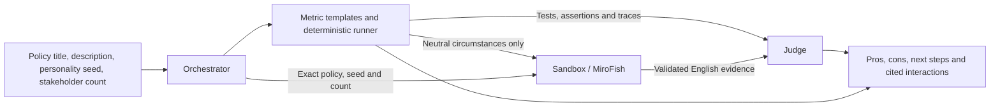

# Assembled PolicyFuzz v2 workflow

The four fields on `/v2` now run through the four roles on the whiteboard.
The former Fuzz Agent is named Metric Agent. MiroFish stakeholders are participants
inside Sandbox, not additional product roles.



## Start locally

Install the backend and frontend dependencies once, using Python 3.12 and Node 20+:

```bash
python3 -m venv backend/.venv
backend/.venv/bin/python -m pip install -e './backend[dev]'
npm --prefix frontend ci
```

Offline mode needs no provider credentials:

```bash
npm run dev:v2
```

Open `http://127.0.0.1:5173/v2`, click **Load synthetic example**, then **Run fixture
workflow**. Metric executes the actual policy rules; Sandbox dialogue and Judge
advice are clearly labelled fixture demonstrations. The synthetic policy intentionally
contains two defects: overlapping approvals and duplicate journeys. With all 12
templates, expect 10 passes and 2 failures. The separate fixture demonstration remains
available at `/v2/fixture`.

The MiroFish installation identified for this checkout is
`/Users/a123/Desktop/mirofish/MiroFish`, including its existing `backend/.venv`.
The sibling `/Users/a123/Desktop/mirofish/engine` is the older policy rehearsal
sidecar; it is not the native MiroFish service used by this v2 integration.

To start all three services, first stop any existing copies on ports 5002, 8002
and 5173, then run:

```bash
LLM_TIMEOUT_SECONDS=90 npm run dev:v2 -- \
  --mirofish-root /Users/a123/Desktop/mirofish/MiroFish \
  --judge-model gpt-4.1
```

The launcher uses MiroFish's existing `.env` for the v2 server, without copying or
printing its key, and installs the existing v2 extension in the running MiroFish app.
It does not edit MiroFish source. Ctrl+C stops the three service processes. Native
simulation work should be allowed to complete or stopped through the MiroFish job
controls before terminating services.

If MiroFish is already serving the v2 extension on port 5002, launch only API and UI:

```bash
LLM_TIMEOUT_SECONDS=90 npm run dev:v2 -- \
  --env-file /Users/a123/Desktop/mirofish/MiroFish/.env \
  --judge-model gpt-4.1
```

Choose **Live MiroFish and Judge** explicitly in the UI. Start with three participants
and two rounds. Live mode makes paid provider calls with the submitted policy and
seed. Use synthetic or explicitly non-confidential material.

`gpt-4.1` is an explicit tested Judge override, not a silent default or fallback.
The existing participant model remains configured by `LLM_MODEL` / `LLM_MODEL_NAME`.
The initial `gpt-4o-mini` Judge attempts rejected their own advice, so model choice
matters even when transport and schema checks succeed. Semantic review can still
miss an incorrect claim; successful processing is not policy certification.

For other installations, substitute their MiroFish checkout path and provider
configuration. `--env-file` overrides the file inferred from `--mirofish-root`.
MiroFish itself retains its own provider configuration; align both configurations.
Server environment settings take precedence over the v2 dotenv values.

## Public API and boundaries

- `GET /api/v2/workflows/capabilities`: configuration availability, without keys or model details.
- `GET /api/v2/workflows/health`: backend liveness, live configuration, and a
  bounded MiroFish extension reachability check. Provider configuration is
  explicitly `configured_not_checked`; this endpoint makes no model calls.
- `GET /api/v2/workflows/sample`: the authored synthetic reimbursement policy.
- `POST /api/v2/workflows`: `policy`, `mode`, `test_budget` (1–12), `max_rounds`
  (1–20), `sandbox_timeout_seconds` (1–600), and optional fixture selection.
- Existing `/api/v2/runs` and `/api/v2/health` retain the Sandbox-only fixture contract.

The response carries Metric, public Sandbox and Judge evidence, four stage outcomes,
mode, limitations, policy hash and one shared run ID. A failed or invalid stage
cannot be labelled complete. Valid earlier evidence is retained when a later stage
fails. Missing live configuration returns 503; it never runs a fixture instead.
Input errors are sanitized. Invalid evidence and raw provider exceptions remain private.

Metric derives reimbursement assertions from explicit goals in the controlled policy format.
The 12 templates cover normal, boundary,
compound, cascading and adversarial actions. Each rejected action preserves state.
Failures have a reproducible sequence reduced by action deletion. The suite hash
binds case definitions, actions and assertions. This is bounded testing, not an
exhaustive search or a general natural-language policy interpreter.

Ordinary prose also has a bounded `policy_conditions` path. It extracts explicit
numeric comparisons for age, assessable/annual/monthly income, home annual value,
and property count. Thresholds are read from the submitted text with source offsets
and SHA-256 hashes, not a GST-specific amount template. Each comparison generates
three probes immediately below, at and above its threshold. Decimal dollar amounts
use integer cents; incomplete amounts, unsupported units, negation and exceptions
are conservatively skipped. No model assigns these expected boundary outcomes.

These tests check conformance of the interpreted comparison model, not a deployed
benefits implementation or independent policy correctness. They do not combine
conditions or establish citizenship, residence, voucher-use restrictions, benefit
eligibility, payout tiers or proration. Every such run has `status=partial` and
reserves one test-budget slot for an unscored combined-outcome case, even at a
budget of one. Unmatched ordinary prose now uses `policy_scenarios`: bounded,
unscored questions with no execution traces or authoritative expected outcomes.
Malformed controlled-format input still requires clarification with zero cases.
An unsupported interpretation is not evidence that the source policy lacks a rule.
Judge can now review the supported comparisons and qualitative Sandbox evidence,
while the incomplete-evidence gate continues to block pilot approval.

Sandbox receives exact input text, personality seed, stakeholder count and neutral
case circumstances. It receives no Metric verdicts, expected results or assertions.
Its complete request fingerprint is checked before the public projection is accepted.
Original records and full prompts never enter the browser or Judge input.

Judge receives matching Metric and public Sandbox evidence; its result identity,
citations, recommendation gates and mode are validated. The live adapter additionally
checks actual reply pairs and runs a grounding review. Failed advice is shown as
unavailable, never manufactured from a fixture. Browser validation checks counts,
references, mode and the hash of the exact submitted policy before rendering.
When Metric has no supported executable interpretation, usable Sandbox discussion
can still reach the Judge model for a qualitative report with cited interactions
and next steps. Policy pros/cons and revision/approval verdicts are blocked on that
path. Without usable discussion, a deterministic explanation identifies both gaps
and states that no model was called. Participant questions and parser limitations
cannot establish actual policy omissions.

Rosters are generated and verified in batches of five, with at most two repairs
per invalid batch and one retry for transient provider failures. The UI exposes
a one-to-ten-minute Sandbox deadline (eight minutes by default). Safe attempt
metadata, including failures before native preparation, is retained in
`backend/cache/v2-diagnostics.sqlite`; it contains fixed codes and identity/count
metadata, never policy text, seeds, prompts or raw provider responses.
See the [consolidated incident fix and live acceptance record](INCIDENT-FIXES-2026-09-11.md).

`JUDGE_MODEL` optionally separates Judge from the participant model.
`JUDGE_TIMEOUT_SECONDS` defaults to 150; `JUDGE_MAX_REPAIRS` defaults to 2 (at most
six provider calls). `JUDGE_RESPONSE_FORMAT` defaults to `json_schema`.
`LLM_TIMEOUT_SECONDS` controls individual provider requests; 90 seconds was used
for the larger live Judge evidence check. Clients are reused and closed on API shutdown.

Sandbox reserves 20% of its request deadline for capture. Native participant
actions have a separate maximum 60-second budget, starting after the concurrency
queue; native reset/steps also have a bound. The wrapper detects a failed platform
dispatcher, cancels pending actions and responds to SIGTERM during an active round.
Stop acknowledgement and a bound job-status reconciliation each have up to 20
seconds; the outer Orchestrator allows 45 seconds of cleanup beyond the request
deadline. Partial and cancelled outcomes stay visible. A lost HTTP
connection or reload does not prove the native simulation stopped; inspect MiroFish
before retrying. This local synchronous API has no durable run listing, browser
recovery, streaming progress, multi-user authentication, or v2 revision loop.
MiroFish retains native job journals and raw evidence in its local uploads folder.
Job lookup persists reconciled statuses using a snapshot comparison inside a
SQLite transaction. A late poll cannot overwrite another process's cancellation
or completion. Terminal records remain readable when the engine is unavailable;
historical stale records reconcile on their next lookup.
Each new native run also writes `policyfuzz_progress.json`: active/completed rounds,
actual action counts (excluding seeded openings), pending participant IDs, timestamps
and sanitized failure codes. The extension projects this into native run status;
forced termination reconciles the environment's stopped state. Progress events
do not replace or manufacture conversational source messages.

The peer feed reads quote/comment records directly. This avoids an installed
OASIS comment-expansion bug (`num_reports` is unbound when the first post is a
quote), while preserving quote author, parent post, comment and source identities.
See the [workweek incident and fix record](FOUR-DAY-WEEK-RUN-2026-09-11.md).

For an offline check against an installed native engine, use that engine's Python:

```bash
/path/to/MiroFish/backend/.venv/bin/python scripts/check_v2_native.py
```

It runs ten deterministic synthetic participants through two real OASIS rounds,
including a quote-first feed, and checks 20 actions and 30 messages. It makes no
model calls and keeps its database and logs in a temporary directory.

## Verification

```bash
backend/.venv/bin/python -m pytest backend/tests -q
backend/.venv/bin/python scripts/check_v2_foundation.py
backend/.venv/bin/python -m app.v2.export_api --check
backend/.venv/bin/python -m app.v2.export_judge --check
npm --prefix frontend run check:generated
npm --prefix frontend run typecheck
npm --prefix frontend run test:run -- --maxWorkers=2
npm --prefix frontend run build
backend/.venv/bin/python scripts/check_v2_workflow.py --output /tmp/v2-fixture.json
```

Tests use fake model and MiroFish transports, including an assembled run through
the actual Sandbox and Judge adapter classes. They cover mismatched identity/mode,
missing configuration, neutral seed handoff, rejected citations, timeouts, cancellation,
translation gaps, unscored policies, browser validation and independent test counts.
The HTTP smoke test needs localhost socket permission.

For an explicitly selected live CLI check while MiroFish is running:

```bash
JUDGE_MODEL=gpt-4.1 LLM_TIMEOUT_SECONDS=90 \
backend/.venv/bin/python scripts/check_v2_workflow.py --live \
  --env-file /Users/a123/Desktop/mirofish/MiroFish/.env \
  --count 3 --rounds 2 --output /tmp/v2-live.json
```

The check uses only the tracked synthetic example, writes only the public workflow
result, closes clients and exits nonzero on an incomplete run. Keep fresh live evidence
distinct from saved fixtures and historical component-only samples.

## Local acceptance record — 11 September 2026

The clean `policyfuzz-main` worktree was fast-forward checked against GitHub main
at `efedfeb` (already current), then integration changes were made on
`p1/fix-v2-agent-integration`. Existing changes in the other three PolicyFuzz
worktrees and the MiroFish checkout were preserved. No push or merge was performed.

- Backend: **1,773 tests passed**, plus 2 subtests, including a real-localhost HTTP check.
- Frontend: **219 tests passed**; generated types, TypeScript and production build passed.
  The unrestricted worker run hit timeouts while the live services were active;
  the complete run passed with two workers, without increasing test deadlines.
- Legacy exploratory engine: **83 tests passed** using its separate environment.
- Foundation, Sandbox/Judge schema checks, backend lint/format and whitespace checks passed.
- Browser fixture: all four stages completed and rendered their evidence.
- Browser live: run `81fd9f00-6e7c-44c3-ad7d-4018cfae314b` completed through
  `/api/v2/workflows`, with **3 requested/configured/observed participants**, **2 rounds**,
  **10 messages**, **12 Metric cases (10 pass / 2 fail)** and completed live Judge advice.
  MiroFish simulation: `sim_5bc698f0e1a7`. Judge used `gpt-4.1`; participant generation
  used the existing `gpt-4o-mini` configuration. The browser accepted the response
  and a Judge step citation opened the exact test trace.
- Exact synthetic policy hash:
  `f1476b3974cf09fd19a9bf7b84ff14cb8a4703c64f40e55cc3158815e9f94f64`.
- Frozen template suite hash:
  `9fb1a03ca27f917dcb320a933d5ee046893d4b0db4e980e3c6d0277b875b6388`.

The two failures are intentionally present in the synthetic policy, not failed
integration tests. They produce a `revise_before_pilot` recommendation. The complete
live result establishes that this local configuration ran end to end once; model
quality, availability and future outputs remain variable. No credentials, raw
provider responses, private policies or whiteboard attachments are included in this record.
