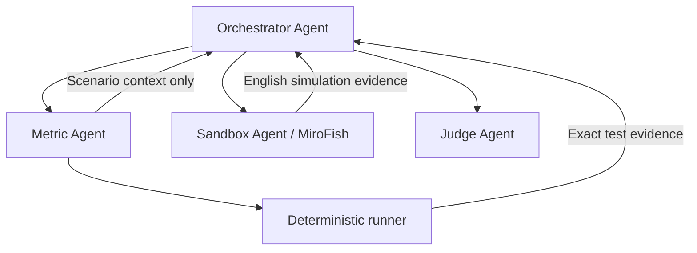

# PolicyFuzz v2: two people, one shared interface

This branch contains the first core milestone: a four-field `/v2` form, a
standalone Orchestrator API and an English evidence screen using the synthetic
Sandbox fixture. The existing v1 application remains available. Metric tests,
Judge evaluation, persistent runs and the live MiroFish adapter are later work.

## Run the first core milestone

On `p1/feat-v2-core`, use Python 3.12+ and Node 20+. From the repository root:

```bash
python3 -m venv backend/.venv
backend/.venv/bin/python -m pip install -e './backend[dev]'
npm --prefix frontend ci
npm run dev:v2
```

On Windows, use `py -3.12 -m venv backend/.venv` and
`backend\.venv\Scripts\python.exe -m pip install -e "./backend[dev]"` for the
first two commands; the npm commands are identical. An existing environment can
be reused after installing the backend dependencies. No provider keys are needed.

Open **http://127.0.0.1:5173/v2** (or append `/v2` to Vite's printed URL if that
port is occupied). Click **Load synthetic example**, then **Run fixture**. Change
**Fixture sample** to **Translation unavailable sample** to inspect a partial run.
The API runs on port 8002; Vite proxies `/api/v2` there. `npm run dev:v2` starts
only the v2 API. Use the existing `npm run dev` command when working on v1.

The four policy fields are passed into a bound Sandbox request, but the authored
fixture dialogue does not analyse them. Public evidence includes participant
counts, translation status, replies, source excerpts and request hashes. Original
records are excluded. The API is stateless: it does not save policy submissions or
runs, and a page reload clears the displayed result. This milestone does not add
a translator; the live Sandbox contributor owns parsing and English translation.

Details and verification commands: [First-run handoff](FIRST-RUN.md).

## Pick your branch

| Person | Branch | Owns | Instructions |
| --- | --- | --- | --- |
| Simon | `p1/feat-v2-core` | Orchestrator Agent, Metric Agent, Judge Agent, runner, UI/API and shared contracts | [Core handoff](../../team/v2-core/HANDOFF.md) |
| Friend | `p3/feat-v2-sandbox` | Sandbox Agent, MiroFish, personas, capture, parsing and English output | [Sandbox handoff](../../team/v2-sandbox/HANDOFF.md) |
| Integration | `p1/feat-policyfuzz-v2` | Reviewed changes from both people | Simon integrates |

All three branches start at the same foundation commit. Use a separate local clone
per person. Commit or stash your own existing changes before switching branches.

Simon, from your clone:

```bash
git fetch origin
git switch --track origin/p1/feat-v2-core
```

Friend, from your clone:

```bash
git fetch origin
git switch --track origin/p3/feat-v2-sandbox
```

If the local branch already exists, use `git switch BRANCH_NAME` instead of
creating another tracking branch. Open both feature PRs against
**`p1/feat-policyfuzz-v2`**. After a shared change is merged, update your feature
branch with `git fetch origin` followed by `git merge origin/p1/feat-policyfuzz-v2`.
Simon owns shared contract changes and regenerates the schemas; agree on those
before either person changes their implementation. Submit a focused shared-contract
PR containing the model, regenerated contracts/v2 artifacts and both updated
handoffs. Merge it into integration first. Both people then merge integration into
their own branch before implementing against the changed interface. Do not merge
v2 to main until the assembled app has been reviewed and verified.

The friend needs repository write access to push to the shared branch. If they do
not have it, they can work from a fork and open a cross-fork PR against this
repository's `p1/feat-policyfuzz-v2` branch. In a fork clone, name the original
repository remote `upstream` and use `upstream/...` in the fetch, switch, merge and
SHA comparison instructions; push feature work to the fork's `origin`. The scoped
handoff still applies.

Before either person starts changing code, these commands must print the same
foundation SHA (also recorded in the foundation PR):

```bash
git rev-parse origin/p1/feat-policyfuzz-v2
git rev-parse origin/p1/feat-v2-core
git rev-parse origin/p3/feat-v2-sandbox
```

The branch tips will naturally diverge once development starts. Never reset a
teammate's work merely to make the tips match again.

## Give your coding agent its assignment

Friend can paste:

> Work on p3/feat-v2-sandbox. Read root AGENTS.md, docs/v2/README.md,
> team/v2-sandbox/HANDOFF.md, and the scoped AGENTS.md in your owned folders.
> Implement the Sandbox Agent there using the existing v2 contract. Start with
> fake-client tests, then connect MiroFish. Keep public output in English and
> original evidence backend-only. Report any shared contract or dependency changes
> to Simon. Target your PR at p1/feat-policyfuzz-v2.

Simon can paste:

> Work on p1/feat-v2-core. Read root AGENTS.md, docs/v2/README.md and
> team/v2-core/HANDOFF.md. Build the v2 app using the shared SandboxService and
> explicitly labelled fixture adapter while my friend implements the live Sandbox
> Agent. Own Orchestrator Agent, Metric Agent, Judge Agent, deterministic execution,
> API and UI. Follow the handoff's evidence and regression rules. Target your PR
> at p1/feat-policyfuzz-v2.

## Run the foundation without provider keys

Python 3.12+ is required. From the repository root on macOS/Linux:

```bash
python3 -m venv backend/.venv
backend/.venv/bin/python -m pip install -e './backend[dev]'
backend/.venv/bin/python scripts/check_v2_foundation.py
```

PowerShell:

```powershell
py -3.12 -m venv backend/.venv
backend\.venv\Scripts\python.exe -m pip install -e "./backend[dev]"
backend\.venv\Scripts\python.exe scripts/check_v2_foundation.py
```

An existing backend environment can be reused. The pinned Pydantic version makes
generated schema comparison reproducible; this foundation does not change the
legacy app's dependency declarations. The check runs only foundation tests,
schema/fixture drift checks and a synthetic adapter smoke run. It does not start
MiroFish, call a model or prove that the full v1 or v2 application works.

## Shared contract

The Python source of truth is [app.v2.contracts](../../backend/app/v2/contracts.py).
The async port is [SandboxService](../../backend/app/v2/protocols.py).
[contracts/v2](../../contracts/v2) contains generated JSON schemas and examples.
The interface is an internal Python boundary; no `/api/v2` endpoint is introduced
by this foundation.

```python
from app.v2.contracts import public_sandbox_result, validate_sandbox_result
from app.v2.fixtures import FixtureSandboxService, make_example_request

async def run_example():
    request = make_example_request()
    result = await FixtureSandboxService().run(request)
    validate_sandbox_result(request, result)
    return public_sandbox_result(result)
```

Simon calls the protocol. The friend implements the future
`app.v2.sandbox.service.MiroFishSandboxService` with the same `async run(request)`
signature. Switch adapters through dependency injection. A failed live run must
never silently become a fixture result.

The four user inputs are policy title, full description, personality seed and
stakeholder count; supporting documents are optional. Derived context and missing
policy assumptions must stay visible. Stakeholder count is separate from Metric
test count. An optional internal random seed is separate from personality text.

The foundation accepts 1–100 stakeholders and a separate 1–100 test budget, with
at most 20 rounds and a 600-second request timeout. These are our current internal
limits, not claims about MiroFish's capacity. A live adapter with a smaller cap must
report the difference and an incomplete result. Fixture dialogue is authored
example data; it does not analyse the supplied policy or personality instructions.

Requests bind exact policy text/version and all settings. Results preserve that
binding, identify fixture/recorded/live execution, distinguish completion from
partial/failure/cancellation, and expose traceable English messages. Use the public
projection for the browser and Judge input; never serialize the internal result
directly into an API response.

## Agent flow to implement next



Only the four named agents are agent roles. The runner, parser, translator and
storage are tools. MiroFish stakeholders are participants within Sandbox.

- **Metric Agent:** automatically generates normal cases, boundaries, compounds,
  cascading failures, adversarial behaviour and extreme plausible combinations.
  Scored assertions need cited policy requirements or reviewed explicit goals.
- **Sandbox Agent:** simulates stakeholder behaviour independently; it receives
  circumstances, not desired verdicts. Parsing and translation preserve original
  IDs, values and relationships.
- **Orchestrator Agent:** selects justified stages, records skipped/unsupported
  work, validates evidence and coordinates bounded follow-ups.
- **Judge Agent:** separates exact results from simulated observations and produces
  pros/cons, recommendations/next steps, cited interactions and Metric test cases.

The shared Han-script guard catches a common untranslated-output failure. It is
not a translator or a complete English/translation-quality detector. The friend's
adapter must handle translation and expose an English unavailable placeholder
with partial status when it cannot provide faithful English text.

## Integration acceptance

1. A submitted policy runs through the protocol and produces version-bound evidence.
2. The app shows the actual execution mode and incomplete status.
3. Judge citations resolve to specific returned message IDs or exact test evidence.
4. Public generated text is English; originals remain internal.
5. An unsupported or unasserted test is not scored as a pass.
6. A revision stores real changed prose and linked rules before a fresh simulation;
   deterministic comparisons retain the frozen cases and assertions.

First connect a single policy to the fixture, then the real adapter. Stateful
policy execution, all three core agents, UI/API integration, persistence and the
revision loop are Simon's next work. Real MiroFish integration and translation are
the friend's next work. Historical v1 demos are not evidence of those v2 features.
